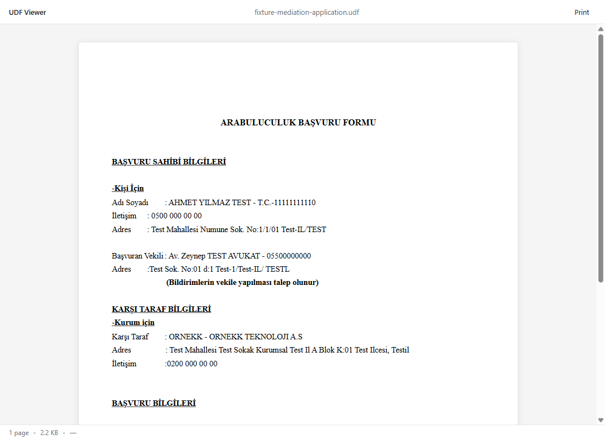

# UDF Viewer

A cross-platform desktop viewer for Turkey's UYAP `.udf` document format. Drop a `.udf` file on the window, see the document, print it. No Java required.



## Why this exists

UYAP (Ulusal Yargı Ağı Bilişim Sistemi — the Turkish judicial information system) issues many of its documents as `.udf` files: a ZIP container holding XML markup with an offset-based styling layer pointing into a CDATA text block. The reference editor UYAP ships is a Java desktop app that's awkward to install on modern machines, refuses to open on some systems, and is editing-oriented rather than viewing-oriented.

UDF Viewer is read-only, lightweight, single-binary, and exists to let lawyers and citizens just *open* a `.udf` they received without fighting an installer.

## Who this is for

- **Turkish lawyers** receiving `.udf` filings from courts and counsel.
- **Citizens** receiving `.udf` documents from UYAP correspondence.
- **Developers** working with UYAP integrations who need a ground-truth viewer to compare against their own parsing.

## Installation

Pre-built binaries for Windows, macOS, and Linux are attached to each [GitHub Release](https://github.com/mfozmen/udf-viewer/releases). Download the artifact for your platform and run it.

| Platform | Artifact |
|----------|----------|
| Windows  | `UDF-Viewer_x.y.z_x64-setup.exe` (NSIS installer) or the portable `udf-viewer.exe` |
| macOS    | `UDF-Viewer_x.y.z_universal.dmg` (Apple Silicon + Intel) |
| Linux    | `UDF-Viewer_x.y.z_amd64.deb` (Debian / Ubuntu) or `udf-viewer_x.y.z_amd64.AppImage` |

### First-run security warnings

These releases are **not code-signed**. The first time you launch UDF Viewer, your OS will warn you:

- **Windows SmartScreen**: "Windows protected your PC." Click "More info" → "Run anyway."
- **macOS Gatekeeper**: "UDF Viewer can't be opened because Apple cannot check it for malicious software." On macOS 15 Sequoia and later, the right-click → Open shortcut no longer appears for unsigned downloads — open System Settings → **Privacy & Security**, scroll to the bottom, and click **Open Anyway** next to the UDF Viewer entry. On macOS 14 Sonoma and earlier, you can also right-click (or Control-click) the app in Finder, choose "Open," then confirm. macOS remembers the override for next time.
- **Linux**: no signing prompt; the AppImage may need `chmod +x udf-viewer_*.AppImage` before running.

If you want to verify the binary instead of trusting the warning, build from source — the steps are below.

## Usage

1. Launch the app.
2. Drag a `.udf` file onto the window.
3. The document renders. Use the **Print** button or `Ctrl/Cmd+P` to print.

The status bar shows the document's page count, file size, and the UYAP verification code (`uyapdogrulamakodu`) when present.

## Building from source

### Prerequisites

- [Node.js 20+](https://nodejs.org/) (with `npm`)
- [Rust stable](https://www.rust-lang.org/tools/install) (latest)
- Platform Tauri prerequisites — see <https://tauri.app/start/prerequisites/>:
  - Linux: `libwebkit2gtk-4.1-dev libgtk-3-dev libayatana-appindicator3-dev librsvg2-dev patchelf` (`patchelf` is required for AppImage bundling, which `bundle.targets: "all"` always attempts)
  - macOS: Xcode Command Line Tools
  - Windows: Microsoft C++ Build Tools, WebView2 (preinstalled on Windows 11)

### Commands

```bash
git clone https://github.com/mfozmen/udf-viewer.git
cd udf-viewer
npm install

# Run in development with hot-reload:
npm run tauri dev

# Build a production binary for your platform:
npm run tauri build
```

The dev workflow runs Vite for the frontend and `cargo run` for the Tauri shell; first compile takes a couple of minutes, subsequent runs are incremental.

### Running the test suite

```bash
npm test
```

The parser, renderer, and security tests live under `test/` and cover both fixtures in `samples/fixtures/`. The UI shell is tested manually — verify by dropping each sample fixture and confirming the rendered output matches the screenshots in `docs/screenshots/`.

## About the UDF format

The `.udf` format is a ZIP archive containing:

- `content.xml` — the document's text in a top-level `<content><![CDATA[…]]></content>` block, plus a sibling `<elements>` tree that styles the text via offset/length pointers into the CDATA. Resolver chains in `<styles>` provide cascading defaults.
- `documentproperties.xml` (optional) — UYAP metadata, including the `uyapdogrulamakodu` verification code.
- `sign.sgn` (optional) — a digital signature blob, ignored by this viewer.

The format **has no public specification**. This implementation was reverse-engineered by inspecting real `.udf` files; the format details documented in `CLAUDE_CODE_BRIEF.md` reflect what was observed, not an official spec. UYAP may change the format at any time without notice.

## Disclaimer

UDF Viewer is **not affiliated with UYAP, Türkiye Cumhuriyeti Adalet Bakanlığı (Ministry of Justice), or any official body**. It's an independent open-source project that reads a publicly-distributed file format. Use at your own discretion; nothing this viewer renders should be treated as a substitute for the original UYAP-issued document where legal authority matters.

## Contributing

Pull requests are welcome — especially:

- **Sanitized test fixtures** that exercise edge cases the current samples don't cover (italic / strikeOut runs, multi-row tables with column spans, headers with multiple paragraphs, etc.). Replace any personal data with dummy values **of identical character length** so all `startOffset` / `length` pointers in the `<elements>` section stay valid.
- **Bug reports** with a sanitized fixture that reproduces the issue, attached to a GitHub issue.
- **Translation help** for any future Turkish-language UI surface (the codebase itself stays English for OSS contribution).

Please read [`CLAUDE.md`](CLAUDE.md) before opening a PR — the project has strict rules around TDD, branch-per-change, and conventional commits.

## License

[MIT](LICENSE) — Copyright (c) 2026 Mehmet Fahri Özmen.
